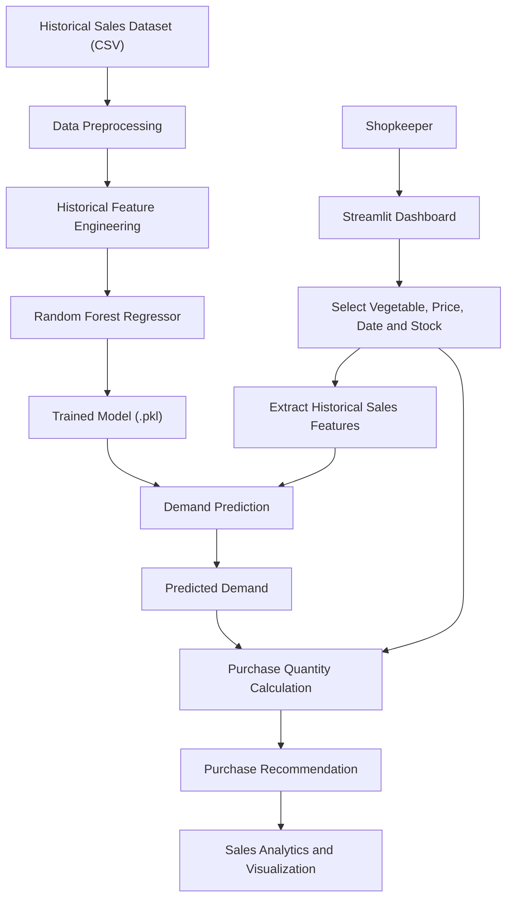

# System Architecture — Seasonal Produce Demand Forecaster

```mermaid
flowchart TD
    A["Historical Sales Dataset (CSV)"] --> B["Data Preprocessing"]
    B --> C["Historical Feature Engineering"]
    C --> D["Random Forest Regressor"]
    D --> E["Trained Model (.pkl)"]

    F["Shopkeeper"] --> G["Streamlit Dashboard"]
    G --> H["Select Vegetable, Price, Date and Stock"]
    H --> I["Extract Historical Sales Features"]
    E --> J["Demand Prediction"]
    I --> J
    J --> K["Predicted Demand"]
    K --> L["Purchase Quantity Calculation"]
    H --> L
    L --> M["Purchase Recommendation"]
    M --> N["Sales Analytics and Visualization"]
```
