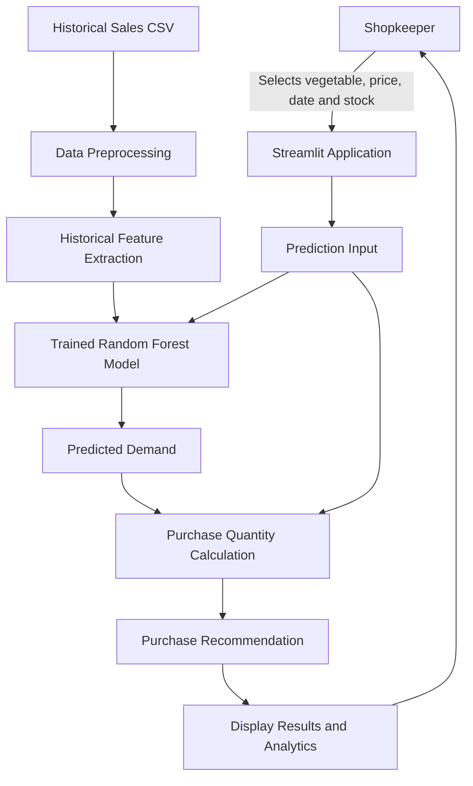

# Data Flow Diagram — Seasonal Produce Demand Forecaster

```mermaid
flowchart TD
    A["Shopkeeper"] -->|Selects vegetable, price, date and stock| B["Streamlit Application"]
    C["Historical Sales CSV"] --> D["Data Preprocessing"]
    D --> E["Historical Feature Extraction"]
    E --> F["Trained Random Forest Model"]
    B --> G["Prediction Input"]
    G --> F
    F --> H["Predicted Demand"]
    H --> I["Purchase Quantity Calculation"]
    G --> I
    I --> J["Purchase Recommendation"]
    J --> K["Display Results and Analytics"]
    K --> A
```
